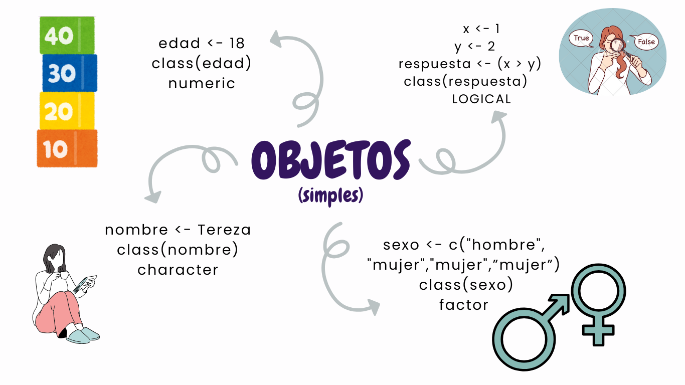
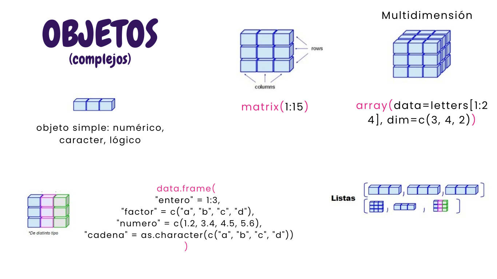

# EXPRESIÓN DIFERENCIAL DE GENES
---
# RSEM
---
# OUTPUT
---
# Recordatorio: Objetos en R


```{r}
Genes <- c("TNF", "APOE", "AKT1", "TGFB1", "EGFR")
Longitud <-  c(48509,32599,8951,2136,3594)
class(Genes)
class(Longitud)
```
---
  
## DATA FRAME
```{r}
df <- data.frame(
  "genid" = paste0("Gen", 1:4), 
  "control" = c(10, 20, 18, 32),
  "tratamiento" = c(20, 30, 18, 32))
```
---
Vamos a usar como ejemplo una base de datos obtenida por RSEM:  

                        ** Sample.genes.results **  
                  
| gene_id  | length  | effective_length  | expected_count  | TPM  | FPKM |
|:------------- |:---------------:| -------------:||:------------- |:---------------:| -------------:|
| **TNF**         | 441        | 296.03        | 31.98         | 8.32        | 15.51        |
| **APOE**         | 231        | 88.33        | 0.80         | 0.70        | 1.30      |
| **AKT1**         | 222      |79.93        | 15.48         | 14.92    |    27.8    |

- **gene_id**: dentificador único del gen
- **length**: La longitud del gen (en pb), calculada considerando los transcritos asociados y su expresión.
- **effective_length**: La longitud ajustada del gen para reflejar la probabilidad de que un read de una longitud x, pueda mapear al gen. Considera la longitud promedio de los fragmentos en el experimento de RNA-Seq.
- **expected_count**: El número estimado de lecturas/fragments asignados a este gen.
- **TPM**: Normalización que representa la abundancia relativa de este gen. Indica cuántas reads se originarían de este gen si hubiera un total de 1 millón de lecturas.
- **FPKM**: Normalización que calcula cuántos reads se mapearon por kilobase de longitud del gen, por cada millón de lecturas totales.
---
## TPM 
Permite hacer comparativos entre muestras   
## FPKM 
Permite hacer comparativos de genes dentro de una misma muestra.
## expected_count 
Es utilizada como input para hacer estadísticos de análisis de expresión diferencial con paquetes como DESeq2 o edgeR.  
---
# Funciones de Rbase para explorar dataframe Sample.genes.results
---

```{r}
data <-  read.table("Databases/Sample.genes.results" , sep = "\t", header = T, row.names = 2)
```

```{r}
class(data) # clase de objeto
dim(data) #obtener las dimensiones del objeto 
ncol(data) # numero de columnas
nrow(data) # numero de genes en el data frame
names(data) #conocer el nombre de las etiquetas de cada columna en un data frame
# head(data) #encabezado del dataframe
```

---
# Extraer información del df.
- Acceder a los elementos, o columnas del data frame
```{r}
# data$ # autocompleta con la tecla "tab"
```

# Conocer cual es el valor mínimo y máximo de una variable:
```{r}
min(data$expected_count)
max(data$expected_count)
```
---
# Anidar funciones para extraer información:
- Identificar el gen de mayor longitud:
```{r}
  max.Length <-row.names(data[which.max(data$length), ] )
  x.Length <-row.names(data)[data$length=="615"]
  y.Length <- (data)[data$length > 10000, ] 
```
---
# Función subsets:
```{r}
# ?subset()
```

```{r}
y.Length <- (data)[data$length > 10000, ]
z.Length <- subset(data, data$length > 10000 ) 
max.Counts <- subset(data, data$expected_count== max(data$expected_count))

```

# Obtener un subset de genes con un número de conteos determinado:
```{r}
threshold.1 <- subset(data, data$expected_count > 1000)
length(threshold.1$transcript_id.s.)
```
---
# Es tu turno: 5 min
Obten genes que con una longitud mayor a 1000 pb y que tegan más de 50 conteos asignados por RSEM.

---
# Respuesta:

```{r}
threshold.2 <- subset(data, (data$expected_count > 50 & data$length > 1000))

```
---
Las funciones de la familia Tidyverse, son muy útiles para manipular bases de datos, de manera fácil y ordenada.
   
---
# DPLYR
Funciones muy útiles para la manipulación de data frames, permitiendo simplificar las acciones sobre este tipo de datoS.  
Son bastante más rápidas.  
[](Figuras/dplyr.png)
- arrange  
- count  
- ***filter***  
- group  
- ***mutate*** 
- rename  
- ***select***  
- ***summarize***  
- ***%>%*** (pipe)
Función de concatenar
---
# filter() 
Selecciona un subconjunto de datos basados en una condición aplicada al set de datos originales.  
*Operadores:*  ==,>,>=,&,|  

```{r}
# filter(dataframe, columna operador "criterio exclusión")
```

---
Podemos hacer el mismo subset del ejemplo anterior utilizando filter():
```{r}
# threshold.1 <- subset(data, data$expected_count > 1000)
# length(threshold.1$transcript_id.s.)
```

```{r include = FALSE}
library(dplyr)
```

```{r}

 data %>% 
 filter(expected_count > 1000) %>%
  count()
```
---
¿Cómo se distribuyen los valores de TPM?

# summarize()
```{r}
data %>%
        summarise(TOTAL = n() , MEAN= mean(TPM) , SD= sd(TPM), VAR= var(TPM)) %>% datawizard::data_rotate(colnames = T, rownames = "TOTAL")
```
---
Tu turno:  

Crea un nuevo objeto donde puedas obtener genes con valores de FPKM > 15 considerados como "sobre representados"; y valores de FPKM < 15 considerados como "reprimidos".

---
# Respuesta
```{r}
OverExpression <-   data %>% 
 filter(FPKM > 15)

DownExpression <- data  %>% 
 filter(expected_count < 15)
  
```

---
# mutate() 
Modifica y/o agrega nuevas variables (columnas) como resultados de funciones de variables previamente existentes.
```{r}
# df %>% mutate(newCol=  mean(1:100))
``` 

Podemos hacer una transformación logaritmica de los conteos observados para cada gen:
```{r}
data <- data %>% 
  mutate(LOG = log10(expected_count))
# data$LOG
```
---
# select()
Realizar un subconjunto de los datos provenientes de un dataframe, como su nombre lo indica permite la selección de ciertas colummnas de interés.
```{r}
data %>% 
  select(gene_id,length, expected_count)%>% 
  head()
```

---
#¿Podemos combinar funciones dplyr?
#filter() %>% select() %>% mutate() 

```{r}
AbRel <-  OverExpression %>% 
  select(FPKM, length) %>% 
  filter(FPKM > 5 & length >1000) %>% 
  mutate(AbunRel= FPKM/sum(data$FPKM))
```

```{r}
head(AbRel)
```
 
---
https://rpubs.com/paraneda/tidyverse 
